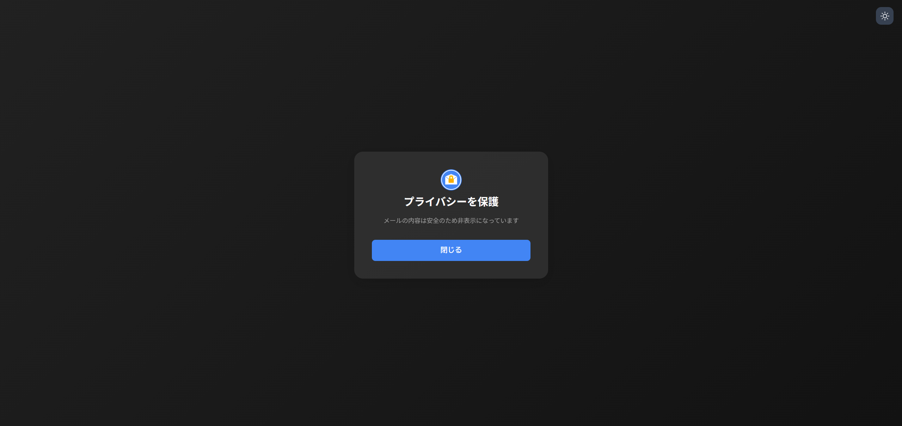

# my.gmail-shield

## 概要

Gmailのプライバシーを保護するためのChrome拡張機能です。

メール内容を一時的に非表示にし、必要なときのみ表示することで、画面共有時や人の目が気になる環境でのGmailの利用をより安全にします。

  

## 機能

- プライバシー保護
  - クリックまたはパスワードによる保護解除
  - 自動再開機能（離脱時、タイマー）

- カスタマイズ
  - ダークモード／ライトモードの切り替え
  - 保護解除方法の選択（クリック／パスワード）
  - 自動再開のタイミング設定
